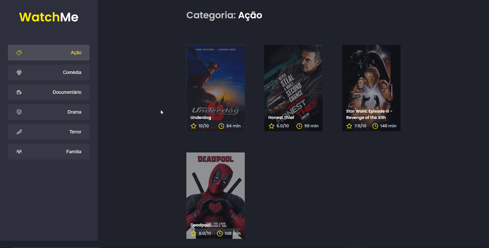

# WatchMe

Application developed to list movies using ReactJs.

## 🚀 Starting

These instructions allowed you to get a copy of the project running on your local machine for development and testing purposes.

### 📋 Prerequisites

The following programs are required to use and modify the project.

- [Git](https://git-scm.com/)

- [NodeJs](https://nodejs.org/en/)

- [NPM](https://nodejs.org/en/)

## 👀 Preview

<p align="center">
  
</p>

### 🔧 Instalation

A series of step-by-step examples that tell you what you must do to get a development environment running.

```
# Clone this repository
$ git clone https://github.com/mateus2a/watchme.git

# Access the project folder in the terminal/cmd
$ cd watchme

# Install dependencies
$ npm install

# Run the application
$ npm start
```

> ⚠️ The server will start at port:3000 - Access <http://localhost:3000>

## 🛠️ Technologies used

The following tools were used in the construction of the project:

- [TypeScript](https://www.typescriptlang.org/)
- [Sass](https://sass-lang.com/)
- [React](https://pt-br.reactjs.org/docs/getting-started.html)

## ✒️ Authors

Here are all the contributors to the project.

- **Mateus Alencar** - _Initial Work, Documentation_ - [mateus2a](https://github.com/mateus2a)

## 📄 License

This project is under the MIT license - see the [LICENSE.md](https://github.com/mateus2a/watchme/blob/main/LICENSE) file for details.

---

By [Mateus Alencar](https://github.com/mateus2a)
